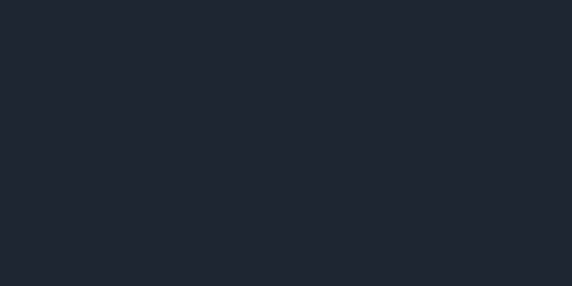

# NVMe Monitor

A GNOME Shell extension that surfaces NVMe drive health directly in the
top-bar menu: SMART log data, temperature, endurance and critical warnings.



> The image above is a **placeholder**. Replace
> `screenshots/nvme-monitor-menu.png` with a real screenshot of the
> extension's menu (same path, same filename) and the README will pick it up
> automatically.

## Features

- **Top-bar indicator** with an NVMe icon and a dropdown menu listing every
  NVMe device on the system.
- **SMART health data** read from `nvme smart-log -o json`:
  - Composite temperature and per-sensor readings, with a thermometer icon
    that reflects the temperature tier.
  - Available Spare, Percentage Used, Power Cycles, Power On Hours.
  - Data Units Read / Written, Unsafe Shutdowns, Host Reads / Host Writes.
  - Media Errors and Critical Warnings, highlighted when set.
- **Vendor-aware parsing** for Samsung, Western Digital, Micron, Crucial,
  SK Hynix and Intel. Manufacturer is detected from the model/serial number,
  and Samsung drives get `Controller` / `NAND` sensor labels.
- **Temperature tiers**: a warm tier (orange) and a hot tier (red) are shown,
  but the red tier is primarily driven by the drive's own `critical_warning`
  bit 1 (the manufacturer-true over-temperature signal), not a guessed °C
  value.
- **Theme-aware styling** — colours come from the GNOME Shell theme, so the
  menu adapts to dark/light mode automatically. No hardcoded colours.
- **Live polling** — the menu refreshes every 5 seconds while open, so the
  values stay current without manual reopening.
- **nvme-cli version awareness** — detects known `nvme-cli` bugs (int32
  overflow in 2.0–2.2; the `nvme list -o json` nested-layout format change in
  2.11–2.12 and 3.0+) and parses both layouts, warning the user when needed.

## Requirements

- GNOME Shell **50 / 51**.
- `nvme-cli` installed (`nvme smart-log` and `nvme list`).
- [polkit](https://www.freedesktop.org/software/polkit/docs/latest/) — used
  to grant the extension passwordless access to read SMART logs.

Install `nvme-cli` from your distribution:

| Distribution | Command |
| --- | --- |
| Fedora | `sudo dnf install nvme-cli` |
| Ubuntu / Debian | `sudo apt install nvme-cli` |
| Arch | `sudo pacman -S nvme-cli` |

## Installation

### From source (development / manual)

1. Clone this repository.
2. Copy or symlink the extension folder into your GNOME Shell extensions
   directory:

   ```bash
   git clone https://github.com/rloutrel/gnome-extension-nvme-monitor.git
   cp -r nvme-monitor@rloutrel.github.com \
       ~/.local/share/gnome-shell/extensions/
   ```

3. Restart GNOME Shell (`Alt+F2` → `r` → `Enter` on X11, or log out and back
   in on Wayland).
4. Enable the extension:

   ```bash
   gnome-extensions enable nvme-monitor@rloutrel.github.com
   ```

### Enabling SMART data (one-time setup)

Until the polkit stack is installed, the extension can still list devices
(from `nvme list`) but cannot read SMART logs, and shows an
**“Install NVMe Stack for SMART data”** entry in the menu.

To enable SMART data, toggle **Service Setup** in the extension menu. This
runs `setup-polkit.sh` once as root (via `pkexec`), which:

- Resolves the `nvme` binary path and hardcodes it into a restricted
  wrapper (`/usr/local/bin/nvme-smart-log-json`) — the wrapper only allows
  `smart-log -o json` on `/dev/nvme*` devices, so there is no shell/PATH
  injection surface.
- Creates a `nvme-smart` system group and adds the invoking user to it.
- Installs the polkit `.policy` action and `.rules` granting members of that
  group passwordless access, for local active sessions only.
- Installs a self-deleting uninstall script.

> **Log out and back in** (or reboot) after setup so your group membership in
> `nvme-smart` takes effect in your GNOME session.

You can verify the setup with:

```bash
pkexec /usr/local/bin/nvme-smart-log-json /dev/nvme0n1
```

It should print SMART log JSON without a password prompt.

### Uninstalling the polkit stack

Run the uninstall script (it removes itself as its last action):

```bash
pkexec /usr/local/bin/nvme-smart-uninstall.sh
```

## Repository layout

```
nvme-monitor@rloutrel.github.com/
  extension.js        # GNOME Shell entry point: indicator, menu, polling
  smartParser.js      # SMART log parsing (vendor parsers), pure module
  tempFormat.js        # Temperature line formatting, pure module
  versionUtils.js      # nvme-cli version detection, pure module
  deviceList.js        # normalize nvme list -o json layouts, pure module
  stylesheet.css       # Theme-aware styles
  metadata.json        # Shell version, UUID, version
  setup-polkit.sh      # Installs the polkit + wrapper stack (run as root)
  icons/bootstrap/     # Bundled SVG icons (Bootstrap Icons, MIT)
  test/                # Unit tests (Node built-in runner)
screenshots/           # Screenshots referenced by this README
```

## Testing

Pure modules (`smartParser.js`, `tempFormat.js`, `versionUtils.js`,
`deviceList.js`) are unit-tested with Node's built-in test runner — no test
framework, no dependencies:

```bash
node --test \
  "nvme-monitor@rloutrel.github.com/test/tempFormat.test.js" \
  "nvme-monitor@rloutrel.github.com/test/smartParser.test.js" \
  "nvme-monitor@rloutrel.github.com/test/versionUtils.test.js" \
  "nvme-monitor@rloutrel.github.com/test/deviceList.test.js"
```

`extension.js` runs inside GNOME Shell (GJS) and cannot be unit-tested
outside it; check it for syntax only with `node --check`.

## License

GPL-2.0 — see [LICENSE](LICENSE).

Bundled icons in `icons/bootstrap/` are from
[Bootstrap Icons](https://icons.getbootstrap.com/) (MIT license); see
`icons/bootstrap/LICENSE`.
